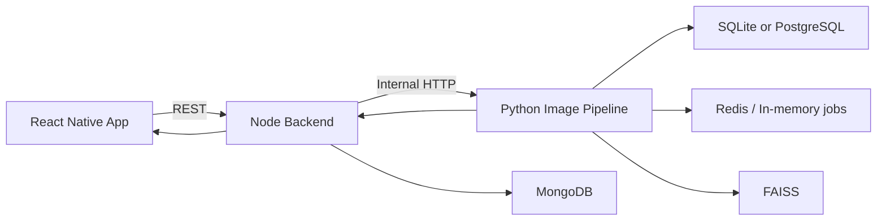
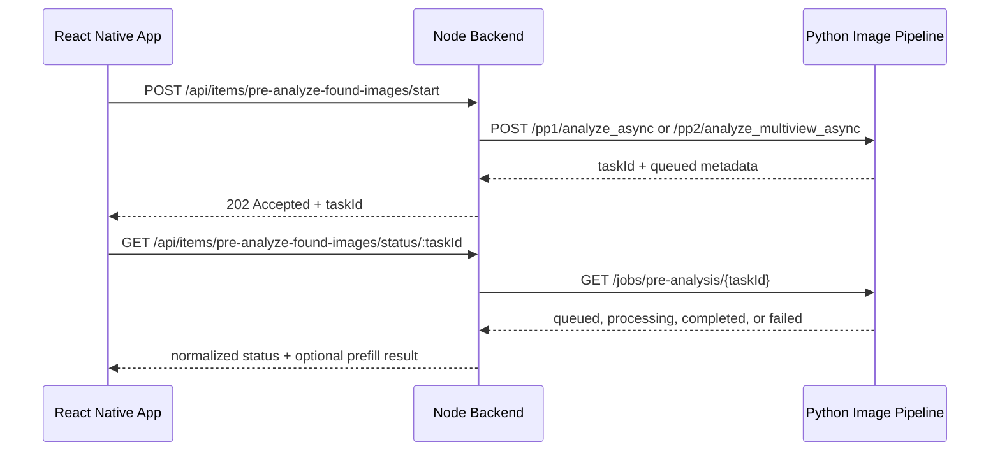

# Image Pipeline Integration Flow

This document explains how the FindAssure mobile app, the Node backend, and the Python image pipeline work together during the main user flows.

Use this file when you need to understand:

- which layer the app talks to,
- where PP1 and PP2 are selected,
- how async pre-analysis works,
- how the final found-item submission loops back into analytics,
- how image search uses the pipeline.

## System Roles

### React Native app

The mobile app is the user-facing layer. It collects images, shows AI suggestions, lets the founder edit them, and submits final found-item data.

Relevant app areas:

- `FindAssure/src/api/itemsApi.ts`
- `FindAssure/src/config/api.config.ts`
- founder reporting screens under `FindAssure/src/screens/`

The app talks to the Node backend using `EXPO_PUBLIC_BACKEND_HOST`. It does not directly call the Python image pipeline in the normal product flow.

### Node backend

The Node backend is the orchestration layer. It:

- receives uploads from the app,
- chooses PP1 or PP2 based on image count,
- calls the pipeline over internal HTTP,
- stores pre-analysis tokens and final found items,
- relays founder feedback analytics back to the pipeline,
- combines image-search results with the rest of the app’s business logic.

Relevant backend files:

- `Backend/src/controllers/itemController.ts`
- `Backend/src/services/imageProcessingService.ts`
- `Backend/src/routes/itemRoutes.ts`

### Python image pipeline

The Python image pipeline is the vision service. It:

- runs PP1 single-image analysis,
- runs PP2 multiview verification and fusion,
- stores async pre-analysis jobs,
- supports image-based vector search,
- stores founder correction analytics.

Relevant pipeline files:

- `Image-Processing-&-Object-Recognition-Pipeline/app/main.py`
- `Image-Processing-&-Object-Recognition-Pipeline/app/routers/pp2_router.py`
- `Image-Processing-&-Object-Recognition-Pipeline/app/routers/search_router.py`

## End-To-End Topology

## Founder Pre-Analysis Flow

This is the main flow where the founder uploads 1 to 3 item images before completing the report.

### Step 1: App uploads images to Node

The app sends the founder’s selected images to the Node backend.

Main app endpoints used:

- `POST /api/items/pre-analyze-found-images`
- `POST /api/items/pre-analyze-found-images/start`
- `GET /api/items/pre-analyze-found-images/status/:taskId`

In the app code, these calls are built in `FindAssure/src/api/itemsApi.ts`.

### Step 2: Node decides PP1 or PP2

The decision is made in `Backend/src/controllers/itemController.ts`.

Selection rule:

- 1 image: Node calls PP1
- 2 or 3 images: Node calls PP2

Internal service calls are implemented in `Backend/src/services/imageProcessingService.ts`.

Pipeline endpoints used by Node:

- 1 image sync: `POST /pp1/analyze`
- 1 image async: `POST /pp1/analyze_async`
- 2 to 3 images sync: `POST /pp2/analyze_multiview`
- 2 to 3 images async: `POST /pp2/analyze_multiview_async`

### Step 3: Pipeline runs PP1 or PP2

#### PP1 path

`app/main.py` accepts the upload, saves a temporary file, runs the unified pipeline, and returns a structured single-image analysis.

Typical result contents:

- detected category
- detailed description
- color
- OCR text
- category details
- embeddings
- Python item id

#### PP2 path

`app/routers/pp2_router.py` accepts 2 or 3 images and runs the multiview pipeline. The pipeline verifies whether the views belong to the same item, then fuses the best evidence into one profile.

Typical result contents:

- verification result
- fused category and attributes
- fused detailed description
- merged OCR tokens
- embedding data
- evidence and filter metadata

### Step 4: Node normalizes the pipeline response

Node does not expose raw pipeline output directly to the app. It converts the pipeline result into prefill fields and stores a pre-analysis token.

Important Node responsibilities here:

- convert PP1 or PP2 output into a common pre-analysis snapshot
- create a `preAnalysisToken`
- preserve useful AI fields such as category, description, color, and analysis evidence
- return either `ok`, `processing`, `queued`, or `manual_fallback`

If the pipeline fails, verification fails, or no usable analysis is available, Node returns a manual fallback response instead of crashing the app flow.

### Step 5: App shows the AI suggestion

The app receives Node’s normalized response, not the raw Python payload. The founder can:

- accept the suggestion,
- edit the category,
- edit the description,
- continue to the final found-item submission.

## Async Founder Flow

The recommended production-style founder flow is asynchronous.

### Async job handling inside the pipeline

The pipeline stores async jobs with `pre_analysis_job_store.py`.

Behavior:

- Redis-backed when available
- in-memory fallback when Redis is unavailable
- status endpoint: `GET /jobs/pre-analysis/{task_id}`

### Why the async flow exists

PP1 and especially PP2 can take enough time that a direct mobile request is less reliable. Async start plus polling keeps the app responsive and lets Node present stable progress states.

## Final Found-Item Submission And Feedback Loop

Once the founder finishes editing and submits the final found item, the Node backend saves the actual application record and then sends feedback back to the image pipeline.

Pipeline analytics endpoint:

- `POST /feedback/founder-prefill`

Purpose of this callback:

- compare predicted category vs final category
- compare predicted description vs final description
- compute change metrics
- record whether the AI suggestion was accepted as-is or edited
- store multiview-related analytics for future tuning

This means the pipeline is not only an inference service. It is also the analytics sink for founder prefill quality.

## Image Search Flow

The pipeline also participates in owner-side image matching.

### How it works

1. The app sends an image-search request to Node.
2. Node uploads the image to the pipeline through `POST /search/by-image`.
3. The pipeline generates one or more crop embeddings.
4. FAISS returns the closest indexed vectors.
5. Node combines or filters these results with the rest of the application logic.

Pipeline search routes:

- `POST /search/by-image`
- `POST /search/index_vector`

Inside the pipeline search flow:

- YOLO crop is tried first
- center crop is also searched
- full-image fallback is searched
- results are deduplicated per FAISS id and then grouped per item id

## Node Backend Internal Pipeline Client

`Backend/src/services/imageProcessingService.ts` is the backend’s dedicated client for the Python service.

Important configuration:

- `IMAGE_PIPELINE_URL`, default `http://127.0.0.1:8002`
- `IMAGE_PIPELINE_TIMEOUT_MS`, default `300000`

Important methods in that service:

- `analyzePP1()`
- `startPP1Analyze()`
- `analyzePP2()`
- `startPP2Analyze()`
- `getPreAnalysisJobStatus()`
- `sendFounderPrefillFeedback()`
- `indexVector()`
- `searchByImage()`

This is the single place where the backend should talk to the Python service.

## Why The Separation Exists

The split between app, Node, and pipeline is intentional.

### App layer

- optimized for user experience
- collects images and shows results
- should not need to know model-specific logic

### Node backend layer

- owns business rules, persistence, and auth
- shields the app from raw ML payloads
- decides when to fall back to manual flow
- can change orchestration without changing the mobile app

### Pipeline layer

- owns computer-vision logic
- can evolve models independently of app business logic
- provides structured evidence, not end-user workflow policy

## Common Integration Scenarios

### Scenario 1: One founder image

- App uploads one image to Node
- Node calls PP1
- Pipeline returns a single-image analysis
- Node stores the pre-analysis token and returns normalized prefill data

### Scenario 2: Two or three founder images

- App uploads multiple images to Node
- Node calls PP2
- Pipeline verifies and fuses views
- Node stores the fused pre-analysis snapshot and returns normalized prefill data

### Scenario 3: Founder edits the AI result

- Node stores the final found item
- Node posts a founder feedback payload to the pipeline
- Pipeline records analytics for model-improvement tracking

### Scenario 4: Owner searches by image

- Node calls pipeline search
- Pipeline returns FAISS matches
- Node merges that with broader app-side retrieval logic

## Failure Handling Model

The system is built so the app can still continue when the pipeline is unavailable or inconclusive.

### Typical fallback points

- Node returns `manual_fallback` when pipeline analysis is missing or unusable
- async jobs can return failed or incomplete status
- Redis outage falls back to in-memory job storage
- Gemini-dependent enrichment is optional and not required for the base pipeline path

This keeps the product flow usable even when some ML steps degrade.

## Practical Development Notes

### To run the full local chain

1. Start the Python pipeline on port `8002`
2. Start the Node backend with `IMAGE_PIPELINE_URL=http://127.0.0.1:8002`
3. Point the Expo app at the Node backend through `EXPO_PUBLIC_BACKEND_HOST`

### Useful code entrypoints when tracing the flow

- App request builder: `FindAssure/src/api/itemsApi.ts`
- Node orchestration: `Backend/src/controllers/itemController.ts`
- Node pipeline client: `Backend/src/services/imageProcessingService.ts`
- Pipeline PP1 API: `app/main.py`
- Pipeline PP2 API: `app/routers/pp2_router.py`
- Pipeline search API: `app/routers/search_router.py`

## Summary

The integration pattern is:

1. the app talks to Node,
2. Node talks to the Python pipeline,
3. the pipeline returns structured ML evidence,
4. Node turns that into app-facing workflow state,
5. the final founder action is relayed back to the pipeline as analytics.

That separation is what lets FindAssure keep mobile, business logic, and vision logic loosely coupled while still supporting PP1, PP2, search, and correction feedback in one coordinated system.
