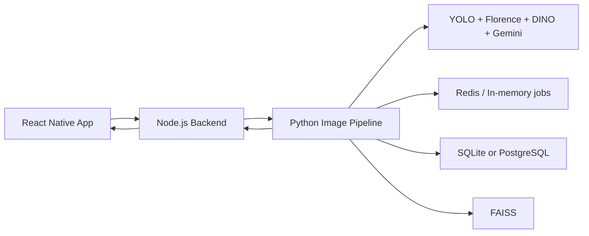

# FindAssure Image Pipeline

The image pipeline is the Python computer-vision backend used by FindAssure for visual pre-analysis, multiview verification, image-based retrieval, and founder correction analytics. It runs as an internal FastAPI service behind the Node backend.

This README focuses on the pipeline itself: what it does, how it is structured, how to run it, and which endpoints it exposes. For the full app-to-backend-to-pipeline request flow, see `INTEGRATION_FLOW_README.md` in this folder.

## What This Service Does

The pipeline handles four core responsibilities:

- PP1 single-image analysis for founder prefill and item understanding.
- PP2 multiview verification and fusion for 2 to 3 images of the same item.
- Visual vector generation and FAISS-based image retrieval.
- Founder feedback analytics after the final found-item submission is saved by the Node backend.

It does not own user authentication, mobile session management, main business workflows, or semantic text search. Those stay in the React Native app, the Node backend, and the separate semantic engine.

## Service Position In The System


```mermaid
flowchart LR
    App[React Native App]
    Node[Node.js Backend]
    Pipe[Python Image Pipeline]
    Models[YOLO + Florence + DINO + Gemini]
    Redis[Redis / In-memory jobs]
    SQL[SQLite or PostgreSQL]
    Faiss[FAISS]

    App --> Node
    Node --> Pipe
    Pipe --> Models
    Pipe --> Redis
    Pipe --> SQL
    Pipe --> Faiss
    Pipe --> Node
    Node --> App
```

The mobile app never calls this service directly in the normal founder flow. The Node backend is the orchestrator and internal API client.

## Main Capabilities

### PP1: Single-image analysis

PP1 is used when the founder submits exactly one image. The pipeline:

1. detects the best object with YOLO,
2. extracts visual evidence with Florence,
3. applies evidence-locked reasoning,
4. creates embeddings with DINO,
5. returns a structured item profile.

Primary routes:

- `POST /pp1/analyze`
- `POST /pp1/analyze_async`

### PP2: Multiview verification and fusion

PP2 is used when the founder submits 2 or 3 images that should represent the same physical item. The pipeline:

1. validates whether the views belong to one item,
2. evaluates view quality and geometric consistency,
3. fuses category, OCR, features, attachments, defects, and descriptions,
4. stores or returns the fused profile.

Primary routes:

- `POST /pp2/analyze_multiview`
- `POST /pp2/analyze_multiview_async`

### Image-based retrieval

The pipeline can index vectors and search by image against a FAISS index.

Primary routes:

- `POST /search/index_vector`
- `POST /search/by-image`

### Founder correction analytics

After the Node backend creates the final found item, it relays founder edits back to the pipeline so the system can measure how much the AI suggestion changed.

Primary route:

- `POST /feedback/founder-prefill`

## Core Runtime Stack

### API and runtime

- Python 3
- FastAPI
- Uvicorn
- Pydantic
- pydantic-settings

### Vision and ML components

- YOLOv8: object detection and primary category proposal
- Florence-2: captioning, OCR, VQA, phrase grounding, category detail extraction
- DINOv2: embedding generation for similarity and retrieval
- Gemini: optional evidence-locked reasoning and enrichment, depending on configuration

### Storage and infrastructure

- SQLite or PostgreSQL through SQLAlchemy
- Redis for async pre-analysis jobs when available
- in-memory job-store fallback when Redis is unavailable
- FAISS for nearest-neighbor vector search

## Repository Structure

```text
Image-Processing-&-Object-Recognition-Pipeline/
├── app/
│   ├── config/                     # settings, model paths
│   ├── core/                       # startup and lifespan
│   ├── domain/                     # label, color, bbox, and category helpers
│   ├── routers/                    # PP2 and search API routers
│   ├── schemas/                    # typed request/response contracts
│   ├── services/                   # PP1, PP2, model wrappers, storage, analytics
│   └── main.py                     # FastAPI app and PP1 routes
├── data/                           # SQLite DB, FAISS index, vector mapping
├── tests/                          # unit and integration tests
├── run_server.py                   # local server entrypoint
├── requirements.txt
├── OVERVIEW.md
└── INTEGRATION_FLOW_README.md      # app/backend/pipeline integration guide
```

## Important Modules

### API entrypoints

- `app/main.py`: FastAPI app, health route, PP1 routes, founder feedback route, pre-analysis job status route.
- `app/routers/pp2_router.py`: synchronous and asynchronous PP2 endpoints.
- `app/routers/search_router.py`: FAISS indexing and image search endpoints.

### PP1 orchestration

- `app/services/unified_pipeline.py`: main single-image pipeline orchestration.
- `app/services/yolo_service.py`: detection wrapper.
- `app/services/florence_service.py`: caption, OCR, VQA, grounding, category-specific detail extraction.
- `app/services/gemini_reasoner.py`: evidence-locked reasoning and optional description enrichment.
- `app/services/dino_embedder.py`: image embeddings for storage and retrieval.

### PP2 orchestration

- `app/services/pp2_multiview_pipeline.py`: end-to-end PP2 flow.
- `app/services/pp2_multiview_verifier.py`: multiview similarity logic.
- `app/services/pp2_geometric_verifier.py`: ORB and RANSAC geometric checks.
- `app/services/pp2_fusion_service.py`: final fusion of labels, OCR, features, defects, attachments, and detailed description.

### Support services

- `app/services/storage_service.py`: persistence helper.
- `app/services/pre_analysis_job_store.py`: Redis-backed or in-memory async job tracking.
- `app/services/founder_prefill_analytics.py`: founder edit and correction analytics.
- `app/domain/category_specs.py`: canonical labels and allowed category-specific details.

## Runtime Configuration

The service uses environment-backed settings from `app/config/settings.py` and `run_server.py`.

### Common settings

- `HOST`: server host, default `0.0.0.0`
- `PORT`: server port, default `8002`
- `RELOAD`: enable reload for local development, default `false`
- `WORKERS`: uvicorn worker count, default `1`
- `LOG_LEVEL`: uvicorn log level, default `info`
- `DATABASE_URL`: default `sqlite:///./data/app.db`
- `REDIS_URL`: default `redis://localhost:6379/0`
- `FAISS_INDEX_PATH`: default `./data/faiss.index`
- `FAISS_MAPPING_PATH`: default `./data/faiss_mapping.json`
- `GOOGLE_API_KEY` or `GEMINI_API_KEY`: optional Gemini access
- `PP2_ENABLE_GEMINI`: default `False`

### Important behavior defaults

- PP2 Gemini enrichment is disabled by default.
- Async pre-analysis jobs use Redis when available and fall back to in-memory storage when Redis is unavailable.
- The pipeline can run with SQLite locally, but production-like flows should use a proper database and stable Redis.

## How To Run Locally

### 1. Install dependencies

```bash
pip install -r requirements.txt
```

### 2. Provide required model assets

Ensure the expected model files and folders exist under `app/models/` and any configured model paths. At minimum, local development typically expects the project’s YOLO and Florence assets to be available.

### 3. Configure environment variables

Create a local `.env` file if needed. Typical values:

```env
PORT=8002
DATABASE_URL=sqlite:///./data/app.db
REDIS_URL=redis://localhost:6379/0
PP2_ENABLE_GEMINI=false
GOOGLE_API_KEY=
```

### 4. Start the server

```bash
python run_server.py
```

Expected local URL:

- `http://127.0.0.1:8002`

### 5. Make sure the Node backend points here

The backend uses `IMAGE_PIPELINE_URL`, and its default already points to `http://127.0.0.1:8002`.

## API Surface

### Health and utility

- `GET /`
- `GET /jobs/pre-analysis/{task_id}`

### PP1

- `POST /pp1/analyze`
- `POST /pp1/analyze_async`
- `POST /analyze` is deprecated and intentionally returns an error directing callers to `/pp1/analyze`

### PP2

- `POST /pp2/analyze_multiview`
- `POST /pp2/analyze_multiview_async`

### Search

- `POST /search/index_vector`
- `POST /search/by-image`

### Analytics

- `POST /feedback/founder-prefill`

## Request Lifecycle Summary

### PP1 single-image request

1. Node uploads one image.
2. The pipeline stores a temporary file.
3. YOLO selects the primary object.
4. Florence extracts caption, OCR, and grounded details.
5. Gemini may refine the result if enabled and applicable.
6. DINO produces embeddings.
7. The pipeline returns a structured result and may persist it.

### PP2 multiview request

1. Node uploads 2 or 3 images.
2. The pipeline normalizes each view.
3. The verifier checks whether the views likely belong to the same item.
4. The fusion service creates a single item profile.
5. The response includes fused OCR, attributes, descriptions, embeddings, and verification output.

## Data And Persistence

The pipeline persists or maintains:

- analysis records in the configured database,
- FAISS index data in `data/faiss.index`,
- vector-to-item mappings in `data/faiss_mapping.json`,
- pre-analysis jobs in Redis or memory,
- founder correction analytics in the database.

Generated files under `data/` and temporary uploads change during normal execution and should not be treated as hand-maintained documentation artifacts.

## Testing

Run targeted tests:

```bash
python -m pytest tests/test_pp2_fusion_service.py -v
python -m pytest tests/test_pp2_multiview_pipeline.py -v
```

Run the full suite:

```bash
python -m pytest tests/ --tb=line
```

## Troubleshooting

### The backend cannot reach the pipeline

Check:

- the pipeline is running on port `8002`,
- the backend `IMAGE_PIPELINE_URL` matches the running address,
- large requests are not timing out against `IMAGE_PIPELINE_TIMEOUT_MS`.

### Async pre-analysis jobs disappear

Check Redis availability. If Redis is down, the service falls back to in-memory job tracking, which is fine for local development but not ideal for durable multi-process workflows.

### Gemini behavior seems inconsistent

Check:

- `GOOGLE_API_KEY` or `GEMINI_API_KEY`,
- `PP2_ENABLE_GEMINI`,
- timeout settings such as `PP2_GEMINI_TIMEOUT_S`.

### Search results are missing

Check:

- vectors were indexed through `/search/index_vector`,
- `data/faiss.index` and `data/faiss_mapping.json` are present and current,
- the category filter or `min_score` is not too restrictive.

## Related Documents

- `INTEGRATION_FLOW_README.md`: how the app, Node backend, and image pipeline connect.
- `OVERVIEW.md`: older system overview and model summary.
- `tests/`: best source of truth for expected behavior changes.
