# Vision Core Backend — FindAssure

> **Image Processing & Object Recognition Pipeline** for the FindAssure Lost & Found System

A high-performance, multi-model hybrid AI backend that **detects**, **analyzes**, **verifies**, and **re-identifies** lost items through two complementary processing phases:

| Phase | Purpose | Input | Key Output |
|-------|---------|-------|------------|
| **PP1** — Single-Image Analysis | Detect an object, extract rich metadata, generate embeddings | 1 image | Structured item profile + DINOv2 embeddings |
| **PP2** — Multi-View Verification & Fusion | Verify 3 views show the same object, fuse results, persist to DB + FAISS | 3 images | Verified fused profile + FAISS-indexed embedding |

---

## Table of Contents

- [System Architecture](#-system-architecture)
- [Tech Stack](#-tech-stack)
- [ML Models](#-ml-models)
- [PP1 Pipeline — Single-Image Analysis](#-pp1-pipeline--single-image-analysis)
- [PP2 Pipeline — Multi-View Verification & Fusion](#-pp2-pipeline--multi-view-verification--fusion)
- [Geometric Verification](#-geometric-verification)
- [Multi-View Fusion](#-multi-view-fusion)
- [FAISS Vector Index](#-faiss-vector-index)
- [Category Specification System (SSOT)](#-category-specification-system-ssot)
- [Database Schema](#-database-schema)
- [Storage & Caching](#-storage--caching)
- [API Reference](#-api-reference)
- [PP2 Response Schema](#-pp2-response-schema)
- [Application Lifecycle](#-application-lifecycle)
- [Project Structure](#-project-structure)
- [Setup & Installation](#-setup--installation)
- [Environment Variables](#-environment-variables)
- [Testing](#-testing)

---

## 🏗 System Architecture


---

## 🛠 Tech Stack

### Frameworks & Infrastructure

| Technology | Role |
|------------|------|
| **Python 3.10+** | Runtime |
| **FastAPI** | Async web framework |
| **Uvicorn** | ASGI server |
| **SQLAlchemy** | ORM (PostgreSQL / SQLite) |
| **psycopg2** | PostgreSQL driver |
| **Redis** (`redis-py`) | In-memory cache |
| **Pydantic Settings** | Configuration management (`.env` support) |

### Machine Learning & Computer Vision

| Technology | Role |
|------------|------|
| **PyTorch** + **Torchvision** | Deep learning backend |
| **Ultralytics** | YOLOv8 object detection |
| **Hugging Face Transformers** | Florence-2 / DINOv2 / SwinIR model inference |
| **Google GenAI SDK** | Gemini 3 Flash cloud API |
| **FAISS** (`faiss-cpu`) | Approximate nearest-neighbor vector search |
| **scikit-learn** | Cosine similarity matrices |
| **OpenCV** | ORB features, RANSAC homography, Laplacian quality |
| **Pillow** | Image I/O and basic enhancement |
| **timm** / **einops** | Model utilities |

---

## 🤖 ML Models

| Model | Role | Dimension | Status | Location |
|-------|------|-----------|--------|----------|
| **YOLOv8** (fine-tuned `final_master_model.pt`) | Object detection & localization (12 categories) | — | **Active** | `app/models/YoloV8n/` |
| **Florence-2** (Base-FT, local) | Captioning, OCR, VQA (color, defects, key count), phrase grounding | — | **Active** | `app/models/florence2-base-ft/` |
| **Florence-2** (Large-FT, local) | Extended VLM capacity | — | Available | `app/models/florence2-large-ft/` |
| **DINOv2** (`facebook/dinov2-base`) | Semantic embedding generation | 768d → 128d (Gaussian projection) | **Active** | `app/models/DINOv2/` |
| **Gemini 3 Flash** (Cloud API) | Evidence-locked reasoning & structured JSON synthesis | — | **Active** | Cloud (requires API key) |
| **SwinIR** | Image super-resolution / restoration | — | Placeholder (PIL enhancement) | `app/models/SwinIR/` |
| **LightGlue** (SuperPoint weights) | Learned feature matching | — | Weights present, **not integrated** | `app/models/LightGlue/` |
| **Qwen 2.5-VL** | Advanced VQA (drop-in Florence replacement) | — | Experimental, **not active** | `app/services/qwen_vl_service.py` |
| **Siamese Network** (ResNet-18 → 128d) | Pair-based re-identification | 128d | Architecture only, **not integrated** | `siamese_network.py` |

---

## 🔄 PP1 Pipeline — Single-Image Analysis

**Endpoint:** `POST /pp1/analyze` · **Input:** 1 image · **Orchestrator:** `app/services/unified_pipeline.py`

The PP1 pipeline takes a single image, detects objects, extracts rich visual evidence, reasons about the evidence using a cloud LLM, and generates embeddings for future similarity search.


### PP1 Detailed Steps

1. **Input Validation** — Requires exactly 1 uploaded image. File is saved to `temp_uploads/`, processed, then cleaned up.
2. **Detection (YOLOv8)** — The fine-tuned model scans the full image for objects across 12 categories. Raw label strings are normalized through `canonicalize_label()` to one of the `ALLOWED_LABELS` (e.g., `"cell phone"` → `"Smart Phone"`). Confidence threshold: `0.25`.
3. **Cropping** — The highest-confidence detection's bounding box is clamped to image bounds, and the region of interest (ROI) is extracted.
4. **Visual Analysis (Florence-2)** — The `analyze_crop()` method runs a multi-task extraction:
   - **Dual Captioning** — Detailed caption + guided VQA caption, both sanitized to remove person/demographic references.
   - **OCR** — Reads text (brand names, serial numbers, "VISA", ID numbers, etc.).
   - **Color VQA** — Asks "What is the dominant color of this object?"
   - **Key Count VQA** — Conditional: only for `Key` category, asks "How many keys?"
   - **Phrase Grounding** — Uses `CATEGORY_SPECS` to physically locate features, defects, and attachments with bounding boxes. Phrases are chunked to avoid prompt overflow.
   - **Attachment VQA Validation** — Verifies detected attachments via yes/no VQA.
5. **Reasoning (Gemini 3 Flash)** — Receives the crop image + full evidence JSON. An **evidence-locked prompt** instructs Gemini to strictly synthesize (not hallucinate) structured JSON: `label`, `color`, `features`, `defects`, `attachments`, `key_count`, `description`.  
   - **Resilience behavior:** transient provider outages (for example `503 UNAVAILABLE`) are retried once, then degraded to a standard PP1 rejected payload with message: `"Reasoning service temporarily unavailable. Please retry."` so `/pp1/analyze` remains available.
6. **Embedding (DINOv2)** — The crop is embedded via the DINOv2 CLS token (768d), then projected to 128d via a deterministic random Gaussian matrix. Both vectors are returned.

---

## 🔄 PP2 Pipeline — Multi-View Verification & Fusion

**Endpoint:** `POST /pp2/analyze_multiview` · **Input:** 3 images · **Orchestrator:** `app/services/pp2_multiview_pipeline.py`

The PP2 pipeline improves re-identification accuracy by processing three different views of the same item. It now runs a fast per-view path with **Florence-lite evidence** (caption/OCR/color) before consensus, rescues label drift via cross-view hints, verifies using eligible (non-outlier) views, then runs full Florence extraction only for pass paths before fusion and persistence.

```mermaid
graph TD
    A["📷📷📷 Client Upload<br/>(3 images)"] -->|"POST /pp2/analyze_multiview"| VAL{"Validation<br/>(exactly 3 images)"}
    VAL -->|Fail| ERR["❌ 400 Error"]
    VAL -->|Pass| LOOP

    subgraph LOOP["Per-View Processing (×3)"]
        direction TB
        L1["Load Image"] --> L2["🔍 YOLOv8 Detect"]
        L2 --> L3["🎯 Top-K Detection +<br/>Provisional Crop"]
        L3 --> L4["⚡ Florence-lite<br/>(caption + OCR + optional color)"]
        L4 --> L5["🗳 Hint-First Consensus +<br/>Per-View Reselection"]
        L5 --> L6["🧬 DINOv2 Embed (128d)"]
        L6 --> L7["📊 Quality Score<br/>(Laplacian variance)"]
    end
    
    LOOP --> VER

    subgraph VER["Verification Stage"]
        direction TB
        V1["📐 3×3 Cosine Similarity Matrix<br/>(scikit-learn)"]
        V2["📐 3×3 FAISS Similarity Matrix<br/>(IndexFlatIP)"]
        V3["🔷 Geometric Verification<br/>(ORB + RANSAC, eligible pairs)"]
        V4["🔤 Semantic Consistency Check<br/>(normalized/bucketed color checks)"]
        V1 & V2 & V3 & V4 --> DEC{"Decision Logic"}
    end
    
    DEC -->|"eligible views < 2"| FAIL["❌ FAILED<br/>(no fusion/storage)"]
    DEC -->|"2 eligible views:<br/>single pair passes"| PASS["✅ PASSED"]
    DEC -->|"3 eligible views:<br/>embedding_failures = 0"| PASS
    DEC -->|"3 eligible views:<br/>embedding_failures = 1 AND geometric_passed_pairs ≥ 2"| SALVAGE["✅ SALVAGED"]
    DEC -->|"Otherwise"| FAIL
    
    PASS & SALVAGE --> EXTR["🔬 Deferred Florence-2 Extraction<br/>(verified triplets only)"]
    EXTR --> FUS

    subgraph FUS["Fusion Stage"]
        direction TB
        F1["🗳 Majority Vote<br/>(category, brand, color)"]
        F2["🔤 Clean + Consensus OCR Merge<br/>(URL/junk filtered)"]
        F3["📋 Attribute Merge<br/>(with conflict tracking)"]
        F4["⚠️ Category-Aligned Merge<br/>(exclude outlier/mismatch views)"]
        F5["⭐ Best View Selection<br/>(quality + confidence)"]
        F6["🧬 Fused Embedding<br/>(L2-norm → avg → renorm)"]
    end
    
    FUS --> STORE
    
    subgraph STORE["Storage Stage"]
        direction LR
        S1[("PostgreSQL / SQLite<br/>ItemRecord +<br/>ViewEvidence +<br/>EmbeddingRecord")]
        S2[("Redis Cache<br/>item:{uuid}<br/>TTL: 24h")]
        S3[("FAISS Index<br/>128d vector added")]
    end
    
    STORE --> RES["📦 PP2Response<br/>(item_id, per_view[3],<br/>verification, fused,<br/>stored, cache_key)"]
    FAIL --> RES
    RES --> Client([Client])
    
    style LOOP fill:#0f3460,stroke:#16213e,color:#e6e6e6
    style VER fill:#533483,stroke:#16213e,color:#e6e6e6
    style FUS fill:#1a5276,stroke:#16213e,color:#e6e6e6
    style STORE fill:#e94560,stroke:#16213e,color:#e6e6e6
```



### PP2 Detailed Steps

#### Stage 1 — Per-View Processing (×3)

For each of the 3 uploaded images:

| Step | Service | Details |
|------|---------|---------|
| **Load** | PIL | Convert `UploadFile` bytes → RGB `Image` |
| **Detect** | YOLOv8 | Collect top-K detections per view (`K=5`) via `detect_objects(..., max_detections=5)` |
| **Florence-lite** | Florence-2 | Run `analyze_crop(..., mode="lite")` on provisional crop (top-1 bbox), collect short caption + OCR (+ optional color), timeout-safe |
| **Hint + Reselect** | Pipeline | Infer canonical hint from lite caption/OCR, compute cross-view hint-first consensus, reselect best top-K detection matching consensus (fallback top-1 marks `label_outlier=true`) |
| **Embed** | DINOv2 | `embed_128()` → 128d normalized vector (for verification) |
| **Quality** | OpenCV | Laplacian variance of grayscale crop (higher = sharper) |
| **Extraction (lite)** | Pipeline | `per_view[].extraction` stores lite extraction with `extraction_confidence=0.4`; upgraded to full extraction only when verification passes |

Cross-view detection selection is done in deterministic stages:
1. **Hint-first consensus**:
   - Build per-view `canonical_hint` from Florence-lite caption/OCR using category keywords.
   - If any hint receives `>=2` votes, use it (`hint_majority` strategy).
2. **YOLO fallback consensus** (when hint majority is absent):
   - Strict majority over top-1 labels.
   - Else coverage/confidence fallback ranking over top-K labels.
3. **Per-view final detection reselection**:
   - Pick highest-confidence top-K detection whose canonicalized label matches the consensus label.
   - If missing in that view, fallback to top-1 and mark that view as `label_outlier`.

#### Stage 2 — Verification

The `MultiViewVerifier` determines whether all 3 views depict the same physical object:

1. **Cosine Similarity Matrix** (3×3) — via `sklearn.metrics.pairwise.cosine_similarity` on the 128d vectors (all views).
2. **FAISS Similarity Matrix** (3×3) — via `FaissService.pair_similarity()` using temporary `IndexFlatIP` with L2-normalized inner product (all views).
3. **Eligible decision pairs** — verification decisions are computed only on `eligible_indices` (non-outlier views):
   - 3 eligible views → 3 decision pairs.
   - 2 eligible views → 1 decision pair.
   - <2 eligible views → immediate failure.
4. **Geometric Verification** (eligible pairs) — ORB + RANSAC (see [Geometric Verification](#-geometric-verification) below); ineligible pairs are marked skipped in `geometric_scores`.
5. **Semantic Consistency** — Colors are normalized (`grey`→`gray`, spacing/hyphen cleanup), conservatively bucketed (`black`/`dark gray`/`charcoal`→`dark`), and flagged only when all 3 bucketed colors are distinct.

**Decision Logic:**

| Condition | Result |
|-----------|--------|
| Eligible views `< 2` | **FAIL** (insufficient eligible views) |
| 2 eligible views and the single pair passes embedding thresholds | **PASS** |
| 3 eligible views and `embedding_failures == 0` | **PASS** |
| 3 eligible views and `embedding_failures == 1` **AND** `geometric_passed_pairs >= 2` | **SALVAGED PASS** |
| Otherwise | **FAIL** (no fusion or storage) |

Notes:
- "Strong geometry" is counted only from geometric verifier `passed=true` pair results, not raw `inlier_ratio` alone.
- Reason strings are boolean-consistent: salvage wording appears only on actual salvage; failed runs include `Not salvaged: ...` with pair-level details.
- Florence full extraction is deferred until after verification. Failed PP2 verification returns schema-valid **lite extraction** (or empty-safe values on lite timeout/error), avoiding expensive grounding workflows.

#### Stage 3 — Deferred Florence + Fusion (if passed)

For passed/salvaged triplets, full Florence extraction is executed only for eligible (non-outlier) views, replacing their lite extraction with normalized full extraction payloads before fusion. Outlier views keep lite extraction.

See [Multi-View Fusion](#-multi-view-fusion).

#### Stage 4 — Storage (if passed)

See [Storage & Caching](#-storage--caching).

#### Service Interface Notes

- `YoloService.detect_objects(image_path_or_array, conf_threshold=0.25, max_detections: Optional[int] = None)`
  - Returns detections sorted by confidence descending.
  - Applies top-K truncation only when `max_detections > 0`.
- `FlorenceService.analyze_crop(crop, canonical_label=None, profile=None, mode="full")`
  - `mode="lite"`: short caption/OCR/color extraction with strict timeout (`FLORENCE_LITE_TIMEOUT_MS`) and safe fallback output.
  - `mode="full"`: full extraction with grounding/features/defects.
- `MultiViewVerifier.verify(..., eligible_indices: Optional[List[int]] = None)`
  - When provided, decisions use only eligible non-outlier views.
  - Similarity matrices remain 3×3 for schema compatibility.
- `MultiViewFusionService.fuse(per_view, vectors, item_id: str, view_meta_by_index: Optional[Dict[int, Dict[str, Any]]] = None)`
  - `item_id` is required to produce deterministic fused embedding IDs.
  - `view_meta_by_index` is optional.
  - When provided, metadata enables outlier-aware category-specific field filtering.
- `MultiViewFusionService.compute_fused_vector(vectors)`
  - Canonical fused vector math: per-vector L2 norm → average → renormalize.
- `PP2PerViewResult`, `PP2FusedProfile`, and `PP2Response` schemas are unchanged.

---

## 🔷 Geometric Verification

**Service:** `app/services/pp2_geometric_verifier.py`

Determines whether two cropped images share enough structural/geometric consistency to be considered views of the same physical object.

```mermaid
graph LR
    A["Crop A"] --> ORB["ORB Feature Detector<br/>(2000 features)"]
    B["Crop B"] --> ORB
    ORB --> BF["BFMatcher<br/>(Hamming distance)"]
    BF --> LOWE["Lowe's Ratio Test<br/>(threshold: 0.75)"]
    LOWE --> RANSAC["RANSAC Homography<br/>(reprojection: 5.0px)"]
    RANSAC --> METRICS["Metrics"]
    
    METRICS --> M1["good_matches"]
    METRICS --> M2["inliers"]
    METRICS --> M3["inlier_ratio"]
    
    M1 & M2 & M3 --> DECISION{"Pass?"}
    DECISION -->|"≥30 good matches<br/>≥15 inliers<br/>≥0.15 inlier ratio"| PASS["✅ Passed"]
    DECISION -->|"Below thresholds"| FAIL["❌ Failed"]
    
    style PASS fill:#27ae60,stroke:#1e8449,color:#fff
    style FAIL fill:#e74c3c,stroke:#c0392b,color:#fff
```



### Thresholds

| Parameter | Value | Purpose |
|-----------|-------|---------|
| `nfeatures` | 2000 | Max ORB keypoints per image |
| Lowe's ratio | 0.75 | Filter ambiguous matches |
| `MIN_GOOD_MATCHES` | 30 | Minimum matches after ratio test |
| `MIN_INLIERS` | 15 | Minimum RANSAC inliers |
| `MIN_INLIER_RATIO` | 0.15 | Inliers / good matches |
| RANSAC reprojection | 5.0 px | Homography error tolerance |

The `verify_triplet()` helper can run all 3 pairwise combinations `(0-1, 0-2, 1-2)` and returns results for each pair.
In PP2 verification, geometric checks are executed for eligible decision pairs; ineligible pairs are recorded as skipped for observability.

---

## 🔀 Multi-View Fusion

**Service:** `app/services/pp2_fusion_service.py`

Merges the 3 per-view results into a single canonical item profile:

| Aspect | Strategy |
|--------|----------|
| **Category** | Majority vote (>50%); fallback to best view |
| **Brand** | Majority vote; fallback to best view |
| **Color** | Majority vote; fallback to best view |
| **Caption** | Conservative structured caption from fused fields (category/color + optional OCR token + optional features); avoids inheriting free-text per-view hallucinations |
| **OCR Tokens** | Clean + consensus merge: drop URL/domain-like chunks, reject noisy tokens, keep tokens seen in ≥2 views (or brand-like singleton from best view), deduped + sorted |
| **Attributes** | Merge `grounded_features`; conflicts tracked in `attributes.conflicts`; always include `attributes.captions` and `attributes.ocr_rejected` |
| **Defects** | Consensus only from eligible views where `final_label == fused_category` and `label_outlier == false`; defect must appear in ≥2 eligible views |
| **Features / Attachments** | Merged only from the same eligible view set used for defects |
| **Best View** | Highest `quality_score`; tie-break by detection `confidence` |
| **Fused Embedding** | L2-normalize each 128d vector → elementwise average → renormalize |

Outlier/mismatch exclusions are auditable:

```json
{
  "conflicts": {
    "category_specific_exclusions": "Excluded category-specific fields from views [2] due to outlier/label mismatch (2:outlier/label_mismatch)."
  }
}
```

`attributes.captions` still retains captions from all views, including excluded outlier views.

When only one eligible view remains, defects are conservatively suppressed and `attributes.conflicts.defects` is set to `"Consensus-based; single-view defects suppressed"` when suppression occurred.

---

## 📊 FAISS Vector Index

**Service:** `app/services/faiss_service.py`

A thread-safe wrapper around Facebook AI Similarity Search for fast nearest-neighbor retrieval:

| Property | Value |
|----------|-------|
| **Index Type** | `IndexFlatIP` (inner product on L2-normalized vectors = cosine similarity) |
| **Dimension** | 128 |
| **Persistence** | Saved to disk on shutdown; loaded on startup |
| **Index File** | `data/faiss.index` |
| **Mapping File** | `data/faiss_mapping.json` (faiss_id → item metadata) |
| **Thread Safety** | `threading.Lock` on all mutations |

### Operations

| Method | Description |
|--------|-------------|
| `load_or_create()` | Load existing index from disk or create a new empty one. Validates dimension match. |
| `add(vector, metadata)` | Normalize, add to index, store metadata mapping. Returns `faiss_id`. |
| `search(vector, top_k=5)` | Find `top_k` most similar vectors. Returns scores + metadata. |
| `pair_similarity(vec_a, vec_b)` | Cosine similarity between two arbitrary vectors (uses temporary index). |
| `save()` | Persist index + mapping to disk. |

---

## 🏷 Category Specification System (SSOT)

**File:** `app/domain/category_specs.py`

The **Single Source of Truth** for all recognized item categories, driving both Florence-2 phrase grounding and Gemini reasoning.

### Allowed Labels (12 categories)

| # | Category | Example Aliases |
|---|----------|-----------------|
| 1 | **Wallet** | billfold |
| 2 | **Handbag** | bag, purse, tote |
| 3 | **Backpack** | rucksack |
| 4 | **Laptop** | computer, notebook |
| 5 | **Smart Phone** | phone, mobile, cell |
| 6 | **Helmet** | — |
| 7 | **Key** | — |
| 8 | **Power Bank** | — |
| 9 | **Laptop/Mobile chargers & cables** | charger, cable, wire |
| 10 | **Earbuds - Earbuds case** | airpod |
| 11 | **Headphone** | headset |
| 12 | **Student ID** | id, card |

### Category Specs Structure

Each category defines three lists used for Florence-2 phrase grounding:

```
CATEGORY_SPECS[label] = {
    "features":    [...],  # Visual characteristics to locate (logo, zipper, ports, etc.)
    "defects":     [...],  # Damage indicators to detect (scratch, crack, frayed cable, etc.)
    "attachments": [...],  # Connected accessories to verify (strap, case, cable, etc.)
}
```

The `canonicalize_label(raw_label)` function maps raw detection strings and common aliases to one of the 12 canonical labels via case-insensitive partial matching.

---

## 🗄 Database Schema

**ORM:** SQLAlchemy · **File:** `app/models/item_models.py`


| Table | Records | Purpose |
|-------|---------|---------|
| **items** | 1 per multi-view analysis | Master item record with fused attributes |
| **view_evidence** | 3 per item | Per-view detection data, captions, OCR, quality |
| **embeddings** | 1 per item (fused) | Links to FAISS index via `faiss_id`, stores dimensionality |

---

## 💾 Storage & Caching

**Service:** `app/services/storage_service.py`

When PP2 verification passes, the `StorageService` persists results in a single atomic operation:


| Layer | Mechanism | Failure Behavior |
|-------|-----------|------------------|
| **Database** | SQLAlchemy transaction (`commit` / `rollback`) | Rolls back entire transaction |
| **Redis** | `SETEX` with 24h TTL, key format: `item:{uuid}` | Logs warning, does not fail main operation |
| **FAISS** | `add()` with metadata mapping | Added during pipeline; saved to disk on shutdown |

---

## 🔌 API Reference

| Method | Path | Input | Output | Description |
|--------|------|-------|--------|-------------|
| `GET` | `/` | — | `{"message": "Vision Core Backend is running."}` | Health check |
| `POST` | `/pp1/analyze` | `multipart/form-data`: 1 file (`files`) | JSON array of detection results | Single-image analysis (YOLO → Florence → Gemini → DINOv2) |
| `POST` | `/analyze` | — | `400` error | **Deprecated** — redirects to `/pp1/analyze` |
| `POST` | `/pp2/analyze_multiview` | `multipart/form-data`: 3 files (`files`) | `PP2Response` JSON | Full multi-view pipeline (detect → extract → verify → fuse → store) |
| `POST` | `/pp2/verify_pair` | `multipart/form-data`: 2 files (`files`) | `PP2VerifyPairResponse` JSON | Quick pair verification (detect → crop → embed → FAISS sim + geometric check) |

### `POST /pp1/analyze` — Response Structure

```json
{
  "status": "accepted",
  "message": "Success",
  "item_id": "uuid-string",
  "image": { "image_id": "uuid", "filename": "photo.jpg" },
  "label": "Wallet",
  "confidence": 0.92,
  "bbox": [x1, y1, x2, y2],
  "color": "Black",
  "ocr_text": "VISA",
  "final_description": "A black leather wallet with...",
  "category_details": {
    "features": ["logo", "card slots"],
    "defects": ["scratch"],
    "attachments": ["chain attached"]
  },
  "key_count": null,
  "tags": ["leather", "bi-fold"],
  "embeddings": {
    "vector_128d": [0.012, -0.034, ...],
    "vector_dinov2": [0.001, 0.045, ...]
  },
  "raw": {
    "yolo": { "label": "Wallet", "confidence": 0.92, "bbox": [...] },
    "florence": { "caption": "...", "ocr_text": "...", ... },
    "gemini": { ... }
  }
}
```

### `POST /pp2/verify_pair` — Response Structure

```json
{
  "cosine_like_score_faiss": 0.91,
  "geometric": {
    "num_keypoints_a": 500,
    "num_keypoints_b": 480,
    "num_matches": 200,
    "num_good_matches": 85,
    "num_inliers": 42,
    "inlier_ratio": 0.49,
    "passed": true
  },
  "passed": true,
  "threshold": 0.85
}
```

---

## 📋 PP2 Response Schema

The full `PP2Response` returned by `/pp2/analyze_multiview`:
The response schema is unchanged (`PP2PerViewResult`, `PP2FusedProfile`, `PP2Response`).

```json
{
  "item_id": "uuid-string",
  "per_view": [
    {
      "view_index": 0,
      "filename": "front.jpg",
      "detection": {
        "bbox": [x1, y1, x2, y2],
        "cls_name": "Wallet",
        "confidence": 0.94
      },
      "extraction": {
        "caption": "A brown leather wallet with visible brand logo",
        "ocr_text": "TOMMY HILFIGER",
        "grounded_features": { "logo": [...], "color": "brown" },
        "extraction_confidence": 1.0
      },
      "embedding": {
        "dim": 128,
        "vector_preview": [0.012, -0.034, 0.056, ...],
        "vector_id": "uuid_view_0"
      },
      "quality_score": 245.7
    }
    // ... (×3 views total)
  ],
  "verification": {
    "cosine_sim_matrix": [[1.0, 0.92, 0.89], [0.92, 1.0, 0.91], [0.89, 0.91, 1.0]],
    "faiss_sim_matrix": [[1.0, 0.91, 0.88], [0.91, 1.0, 0.90], [0.88, 0.90, 1.0]],
    "geometric_scores": {
      "0-1": { "num_good_matches": 85, "num_inliers": 42, "inlier_ratio": 0.49, "passed": true },
      "0-2": { "...": "..." },
      "1-2": { "...": "..." }
    },
    "passed": true,
    "failure_reasons": [
      "Embedding consistency failures: 1/3 pairs (failed: 0-2).",
      "Salvaged: failed_embedding_pairs=[0-2]; geometric_passed_pairs=[0-1, 1-2]."
    ]
  },
  "fused": {
    "category": "Wallet",
    "brand": "Tommy Hilfiger",
    "color": "Brown",
    "caption": "A brown wallet. Text: HILFIGER. Visible: logo, strap.",
    "merged_ocr_tokens": ["HILFIGER", "TOMMY"],
    "attributes": {
      "logo": "brand logo",
      "conflicts": {
        "category_specific_exclusions": "Excluded category-specific fields from views [2] due to outlier/label mismatch (2:outlier/label_mismatch)."
      },
      "captions": {"view_0": "...", "view_1": "...", "view_2": "..."},
      "ocr_rejected": ["HTTPS://EXAMPLE.COM", "WWW.MAINEMEMORY.NET"]
    },
    "defects": ["scratch"],
    "best_view_index": 0,
    "fused_embedding_id": "uuid_fused"
  },
  "stored": true,
  "cache_key": "item:uuid-string"
}
```

Failure reason string style is deterministic:
- Salvaged pass example: `Salvaged: failed_embedding_pairs=[0-2]; geometric_passed_pairs=[0-1, 1-2].`
- Non-salvaged fail example: `Not salvaged: failed_embedding_pairs=[0-1, 1-2]; geometric_passed_pairs=[0-2].`
- Failed verification responses keep schema shape and return Stage-1 lite extraction fields (`extraction_confidence=0.4`), or empty-safe lite values when the lite call times out/errors.

---

## 🔄 Application Lifecycle

**File:** `app/core/lifespan.py`

The FastAPI lifespan context manager controls startup and shutdown behavior:


> **Note:** PP1's `UnifiedPipeline` is instantiated directly in `app/main.py` (not via lifespan), loading its own copies of YOLO, Florence, DINOv2, and Gemini services.

---

## 📂 Project Structure

```
├── app/
│   ├── main.py                          # FastAPI app, PP1 endpoint, CORS, lifespan
│   ├── __init__.py
│   ├── config/
│   │   ├── settings.py                  # Pydantic Settings (.env, defaults)
│   │   └── model_paths.py               # Model weight path resolution
│   ├── core/
│   │   ├── db.py                        # SQLAlchemy engine, session, Base
│   │   ├── lifespan.py                  # Startup/shutdown lifecycle manager
│   │   └── redis_client.py              # Redis singleton client
│   ├── domain/
│   │   └── category_specs.py            # SSOT: 12 categories, specs, canonicalize_label()
│   ├── models/                          # Local model weights & configs
│   │   ├── DINOv2/                      # Meta DINOv2 (dinov2-base)
│   │   ├── florence2-base-ft/           # Microsoft Florence-2 Base (fine-tuned)
│   │   ├── florence2-large-ft/          # Microsoft Florence-2 Large (fine-tuned)
│   │   ├── LightGlue/                   # SuperPoint + LightGlue weights
│   │   ├── SwinIR/                      # SwinIR restoration model
│   │   ├── YoloV8n/                     # Fine-tuned YOLOv8 (final_master_model.pt)
│   │   └── item_models.py              # SQLAlchemy ORM models
│   ├── routers/
│   │   └── pp2_router.py               # PP2 endpoints (analyze_multiview, verify_pair)
│   ├── schemas/
│   │   └── pp2_schemas.py              # Pydantic models for PP2 request/response
│   └── services/
│       ├── unified_pipeline.py          # PP1 orchestrator (YOLO → Florence → Gemini → DINOv2)
│       ├── pp2_multiview_pipeline.py    # PP2 orchestrator (per-view → verify → fuse → store)
│       ├── pp2_multiview_verifier.py    # Multi-view verification (cosine + FAISS + geometric)
│       ├── pp2_geometric_verifier.py    # Geometric verification (ORB + RANSAC)
│       ├── pp2_fusion_service.py        # Multi-view fusion (majority vote, merge, fused embedding)
│       ├── yolo_service.py              # YOLOv8 wrapper
│       ├── florence_service.py          # Florence-2 wrapper (caption, OCR, VQA, grounding)
│       ├── gemini_reasoner.py           # Gemini 3 Flash wrapper (evidence-locked reasoning)
│       ├── dino_embedder.py             # DINOv2 wrapper (768d + 128d projection)
│       ├── faiss_service.py             # FAISS vector index (IndexFlatIP, 128d)
│       ├── storage_service.py           # DB + Redis persistence
│       ├── swinir_enhancer.py           # SwinIR wrapper (currently: PIL placeholder)
│       ├── qwen_vl_service.py           # Qwen 2.5-VL wrapper (experimental, not active)
│       └── pp2_services.py              # Legacy stub implementations (superseded)
├── data/
│   ├── faiss.index                      # Persisted FAISS index
│   └── faiss_mapping.json               # FAISS ID → item metadata mapping
├── groundingdino/
│   ├── config/                          # GroundingDINO configuration
│   └── weights/                         # GroundingDINO weights
├── tests/
│   ├── test_pp2_api.py                  # Integration test (mocked services)
│   ├── test_pp2_geometric.py            # Geometric verifier unit tests
│   ├── test_pp2_verifier.py             # Multi-view verifier logic + reason consistency + semantic checks
│   ├── test_pp2_multiview_pipeline.py   # Cross-view label consensus, outlier fallback, fusion metadata wiring
│   ├── test_pp2_fusion_service.py       # OCR cleaning/consensus + outlier-aware category-specific merging
│   └── test_yolo_service.py             # Detection ordering + max_detections behavior
├── temp_uploads/                        # Temporary file storage (auto-cleanup)
├── weights/                             # Additional weight files
├── siamese_network.py                   # Siamese Network architecture (ResNet-18, not integrated)
├── run_server.py                        # Uvicorn launcher (host=0.0.0.0, port=8000)
├── requirements.txt                     # Python dependencies
└── OVERVIEW.md                          # Brief PP1 overview
```

---

## ⚡ Setup & Installation

### Prerequisites

| Requirement | Details |
|-------------|---------|
| **Python** | 3.10 or higher |
| **GPU** | NVIDIA GPU with CUDA 11.8+ (recommended for model inference) |
| **Redis** | Running Redis server (for caching; pipeline works without it but logs warnings) |
| **PostgreSQL** | Optional (default: SQLite at `data/app.db`) |
| **Gemini API Key** | Required for PP1 reasoning via Google GenAI SDK |

### Installation

1. **Clone the repository:**
   ```bash
   git clone <repository-url>
   cd Image-Processing-&-Object-Recognition-Pipeline
   ```

2. **Create a virtual environment:**
   ```bash
   python -m venv venv
   # Linux/macOS
   source venv/bin/activate
   # Windows
   venv\Scripts\activate
   ```

3. **Install dependencies:**
   ```bash
   pip install -r requirements.txt
   ```

4. **Download model weights:**
   Ensure all model weights are placed in their respective directories under `app/models/`:
   - `app/models/DINOv2/` — DINOv2 base (`model.safetensors`, `config.json`, `preprocessor_config.json`)
   - `app/models/florence2-base-ft/` — Florence-2 base fine-tuned (all model files)
   - `app/models/YoloV8n/final_master_model.pt` — Fine-tuned YOLOv8 weights
   - `app/models/SwinIR/` — SwinIR weights (optional)
   - `app/models/LightGlue/` — SuperPoint + LightGlue weights (optional, not currently integrated)

5. **Configure environment:**
   Create a `.env` file in the project root:
   ```env
   GOOGLE_API_KEY=your_gemini_api_key_here
   REDIS_URL=redis://localhost:6379/0
   DATABASE_URL=sqlite:///./data/app.db
   ```

6. **Start the server:**
   ```bash
   python run_server.py
   ```

   The API will be available at:
   - **Base URL:** `http://0.0.0.0:8000`
   - **Swagger UI:** `http://0.0.0.0:8000/docs`
   - **ReDoc:** `http://0.0.0.0:8000/redoc`

---

## 🔧 Environment Variables

| Variable | Required | Default | Description |
|----------|----------|---------|-------------|
| `GOOGLE_API_KEY` | **Yes** | — | Google Gemini API key (also accepts `GEMINI_API_KEY`) |
| `REDIS_URL` | No | `redis://localhost:6379/0` | Redis connection URL |
| `DATABASE_URL` | No | `sqlite:///./data/app.db` | SQLAlchemy database URL (PostgreSQL or SQLite) |
| `FAISS_INDEX_PATH` | No | `./data/faiss.index` | Path to persist FAISS index |
| `FAISS_MAPPING_PATH` | No | `./data/faiss_mapping.json` | Path to persist FAISS metadata mapping |
| `PP2_SIM_THRESHOLD` | No | `0.85` | Cosine/FAISS similarity threshold for PP2 verification |
| `VERIFY_THRESHOLD` | No | `0.85` | Similarity threshold for `/pp2/verify_pair` |
| `PERF_PROFILE` | No | `fast` | Inference profile: `fast`, `balanced`, or `quality` |
| `PP1_MAX_DETECTIONS` | No | `1` | Max detections processed in PP1 |
| `PP1_GEMINI_INCLUDE_IMAGE` | No | `false` | If true, PP1 sends crop image to Gemini (higher latency, potentially higher quality) |
| `FLORENCE_FAST_MAX_NEW_TOKENS` | No | `96` | Max generated tokens for Florence tasks in fast profile |
| `FLORENCE_FAST_NUM_BEAMS` | No | `1` | Beam count for Florence generation in fast profile |
| `FLORENCE_LITE_TIMEOUT_MS` | No | `3000` | Timeout for Florence lite mode (`analyze_crop(..., mode="lite")`) |
| `BASE_MODELS_DIR` | No | `app/models/` | Root directory for model weights |
| `QWEN_VL_MODEL_PATH` | No | `{BASE_MODELS_DIR}/Qwen2.5-VL-3B-Instruct` | Qwen-VL model path (if using experimental service) |

---

## 🧪 Testing

The test suite covers the PP2 pipeline components:

| Test File | Type | Coverage |
|-----------|------|----------|
| `tests/test_pp2_api.py` | Integration | Mocks all ML services, tests `POST /pp2/analyze_multiview` with 3 fake images, verifies 200 response and correct `item_id` |
| `tests/test_pp2_geometric.py` | Unit | Tests `GeometricVerifier.verify_pair()` with identical images (should pass) and noise images (should fail) |
| `tests/test_pp2_verifier.py` | Unit | Tests `0/1/2+` embedding-failure branches, eligible-index decision scope (2-view pass / <2-view fail), truthful salvage/non-salvage reasons, geometric gating, and color normalization/bucketing |
| `tests/test_pp2_multiview_pipeline.py` | Unit | Tests top-K usage, hint-first consensus rescue (`hint_majority`) with fallback strategies, lite-stage extraction behavior, eligible-index verifier calls, and fusion/index metadata pass-through |
| `tests/test_pp2_fusion_service.py` | Unit | Tests OCR URL/junk rejection, conservative fused caption generation, outlier/mismatch category-specific field exclusion, and consensus-gated defects |
| `tests/test_yolo_service.py` | Unit | Tests detection confidence sorting, optional top-K truncation via `max_detections`, and uncapped default behavior |

### Running Tests

```bash
# Run all tests
pytest tests/ -v

# Run a specific test file
pytest tests/test_pp2_geometric.py -v

# Run with output
pytest tests/ -v -s
```

---

## 📄 License

This project is part of the **FindAssure Lost & Found System** research project.
