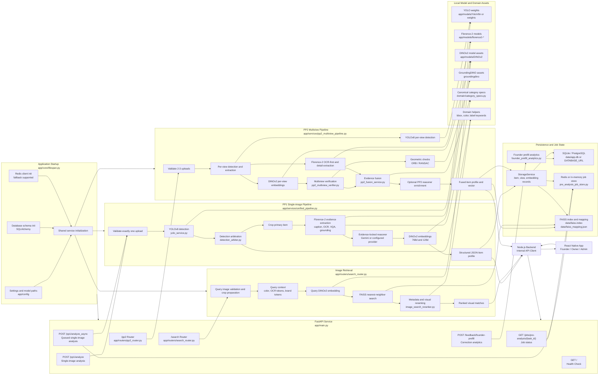

# Image Processing and Object Recognition Pipeline - Component Overview

```mermaid
flowchart LR
    nodeBackend["Node.js Backend<br/>Internal API Client"]
    mobileApp["React Native App<br/>Founder / Owner / Admin"]

    subgraph fastapi["FastAPI Service<br/>app/main.py"]
        health["GET /<br/>Health Check"]
        pp1Sync["POST /pp1/analyze<br/>Single-image analysis"]
        pp1Async["POST /pp1/analyze_async<br/>Queued single-image analysis"]
        pp2Router["/pp2 Router<br/>app/routers/pp2_router.py"]
        searchRouter["/search Router<br/>app/routers/search_router.py"]
        jobs["GET /jobs/pre-analysis/{task_id}<br/>Job status"]
        feedback["POST /feedback/founder-prefill<br/>Correction analytics"]
    end

    subgraph startup["Application Startup<br/>app/core/lifespan.py"]
        settings["Settings and model paths<br/>app/config"]
        dbInit["Database schema init<br/>SQLAlchemy"]
        redisInit["Redis client init<br/>fallback supported"]
        serviceInit["Shared service initialization"]
    end

    subgraph pp1["PP1 Single-image Pipeline<br/>app/services/unified_pipeline.py"]
        pp1Validate["Validate exactly one upload"]
        pp1Yolo["YOLOv8 detection<br/>yolo_service.py"]
        pp1Arbiter["Detection arbitration<br/>detection_arbiter.py"]
        pp1Crop["Crop primary item"]
        pp1Florence["Florence-2 evidence extraction<br/>caption, OCR, VQA, grounding"]
        pp1Reasoner["Evidence-locked reasoner<br/>Gemini or configured provider"]
        pp1Dino["DINOv2 embeddings<br/>768d and 128d"]
        pp1Response["Structured JSON item profile"]
    end

    subgraph pp2["PP2 Multiview Pipeline<br/>app/services/pp2_multiview_pipeline.py"]
        pp2Validate["Validate 2-3 uploads"]
        pp2PerView["Per-view detection and extraction"]
        pp2Yolo["YOLOv8 per-view detection"]
        pp2Florence["Florence-2 OCR-first and detail extraction"]
        pp2Dino["DINOv2 per-view embeddings"]
        pp2Verifier["Multiview verification<br/>pp2_multiview_verifier.py"]
        pp2Geometry["Geometric checks<br/>ORB / RANSAC"]
        pp2Fusion["Evidence fusion<br/>pp2_fusion_service.py"]
        pp2Reasoner["Optional PP2 reasoner enrichment"]
        pp2Fused["Fused item profile and vector"]
    end

    subgraph search["Image Retrieval<br/>app/routers/search_router.py"]
        searchPrep["Query image validation and crop preparation"]
        searchContext["Query context<br/>color, OCR tokens, brand tokens"]
        searchEmbedding["Query DINOv2 embedding"]
        faissSearch["FAISS nearest-neighbor search"]
        reranker["Metadata and visual reranking<br/>image_search_reranker.py"]
        searchResults["Ranked visual matches"]
    end

    subgraph persistence["Persistence and Job State"]
        storage["StorageService<br/>item, view, embedding records"]
        database["SQLite / PostgreSQL<br/>data/app.db or DATABASE_URL"]
        redisJobs["Redis or in-memory job store<br/>pre_analysis_job_store.py"]
        faissIndex["FAISS index and mapping<br/>data/faiss.index<br/>data/faiss_mapping.json"]
        analytics["Founder prefill analytics<br/>founder_prefill_analytics.py"]
    end

    subgraph modelAssets["Local Model and Domain Assets"]
        yoloModel["YOLO weights<br/>app/models/YoloV8n or weights"]
        florenceModel["Florence-2 models<br/>app/models/florence2-*"]
        dinoModel["DINOv2 model assets<br/>app/models/DINOv2"]
        groundingDino["GroundingDINO assets<br/>groundingdino"]
        categorySpecs["Canonical category specs<br/>domain/category_specs.py"]
        domainHelpers["Domain helpers<br/>bbox, color, label keywords"]
    end

    mobileApp --> nodeBackend
    nodeBackend --> fastapi

    startup --> fastapi
    settings --> serviceInit
    dbInit --> serviceInit
    redisInit --> serviceInit
    serviceInit --> pp1
    serviceInit --> pp2
    serviceInit --> search

    pp1Sync --> pp1Validate
    pp1Async --> redisJobs
    pp1Async --> pp1Validate
    pp1Validate --> pp1Yolo --> pp1Arbiter --> pp1Crop --> pp1Florence --> pp1Reasoner --> pp1Dino --> pp1Response
    pp1Response --> storage

    pp2Router --> pp2Validate
    pp2Validate --> pp2PerView
    pp2PerView --> pp2Yolo
    pp2PerView --> pp2Florence
    pp2PerView --> pp2Dino
    pp2Dino --> pp2Verifier
    pp2Verifier --> pp2Geometry
    pp2Verifier --> pp2Fusion
    pp2Florence --> pp2Fusion
    pp2Fusion --> pp2Reasoner
    pp2Reasoner --> pp2Fused
    pp2Fused --> storage
    pp2Fused --> faissIndex

    searchRouter --> searchPrep --> searchContext --> searchEmbedding --> faissSearch --> reranker --> searchResults
    faissSearch --> faissIndex

    jobs --> redisJobs
    feedback --> analytics --> database
    storage --> database
    storage --> redisJobs
    storage --> faissIndex

    pp1Yolo --> yoloModel
    pp2Yolo --> yoloModel
    pp1Florence --> florenceModel
    pp2Florence --> florenceModel
    pp1Dino --> dinoModel
    pp2Dino --> dinoModel
    searchEmbedding --> dinoModel
    pp2Geometry --> groundingDino
    pp1Florence --> categorySpecs
    pp2Fusion --> categorySpecs
    pp1Arbiter --> domainHelpers
    reranker --> domainHelpers

    pp1Response --> nodeBackend
    searchResults --> nodeBackend
    pp2Fused --> nodeBackend
    nodeBackend --> mobileApp
```
